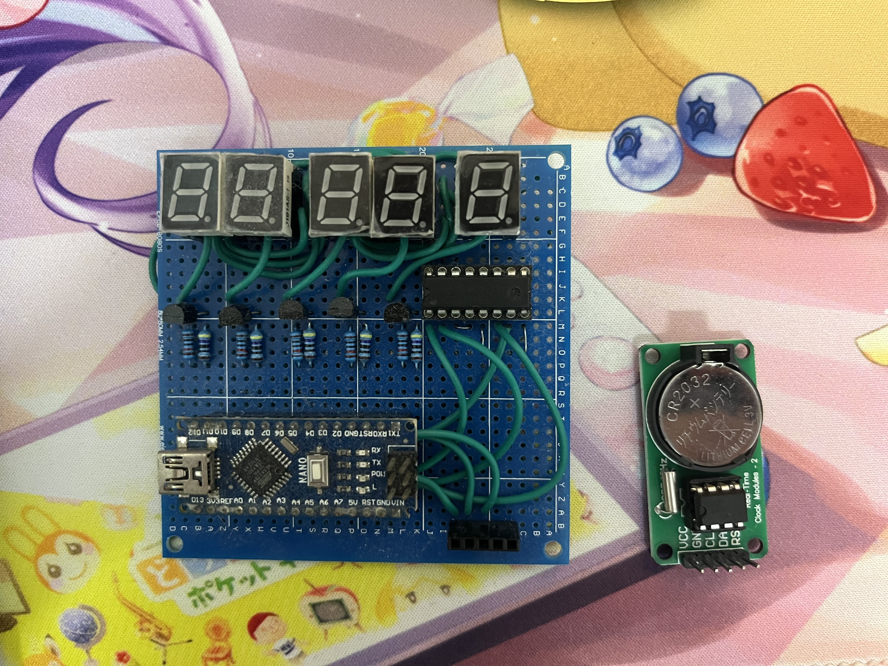
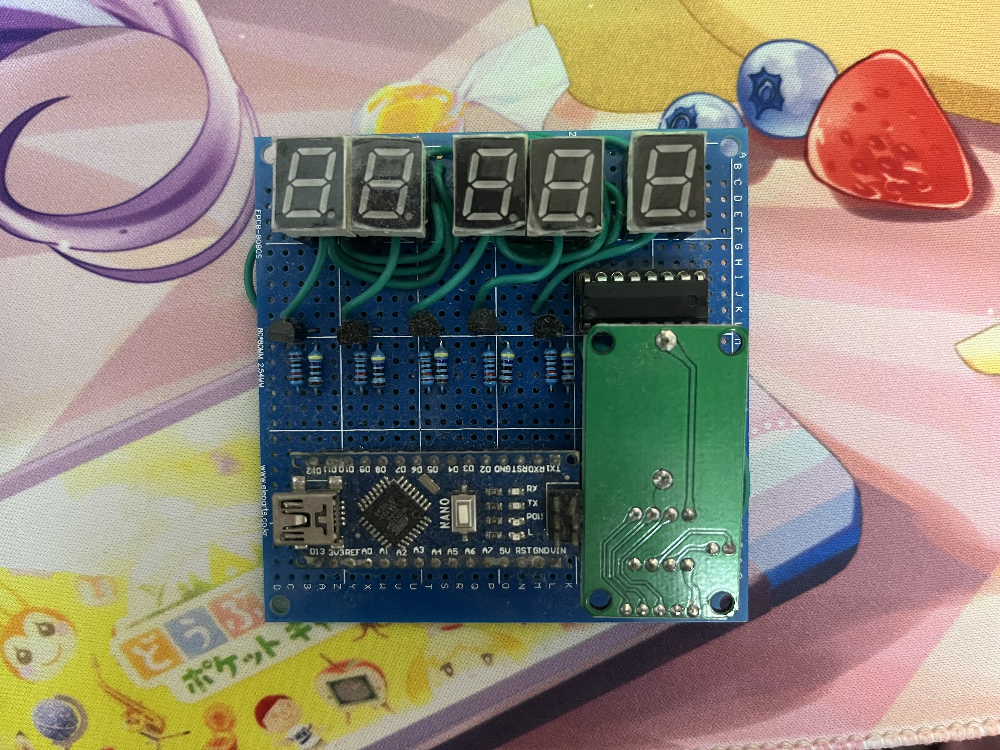

# 7 Segment Clock

Hardware
- Arduino nano (atmega328p-AU) 1x
- DS1302 Real time clock 1x
- CD4511BE 7 segment decoder 1x
- BC547 driven 7 segment 5x
- 7 segment 0.56 inch 5x
- 470 resistor 5x
- 10k resistor 5x

Picture

